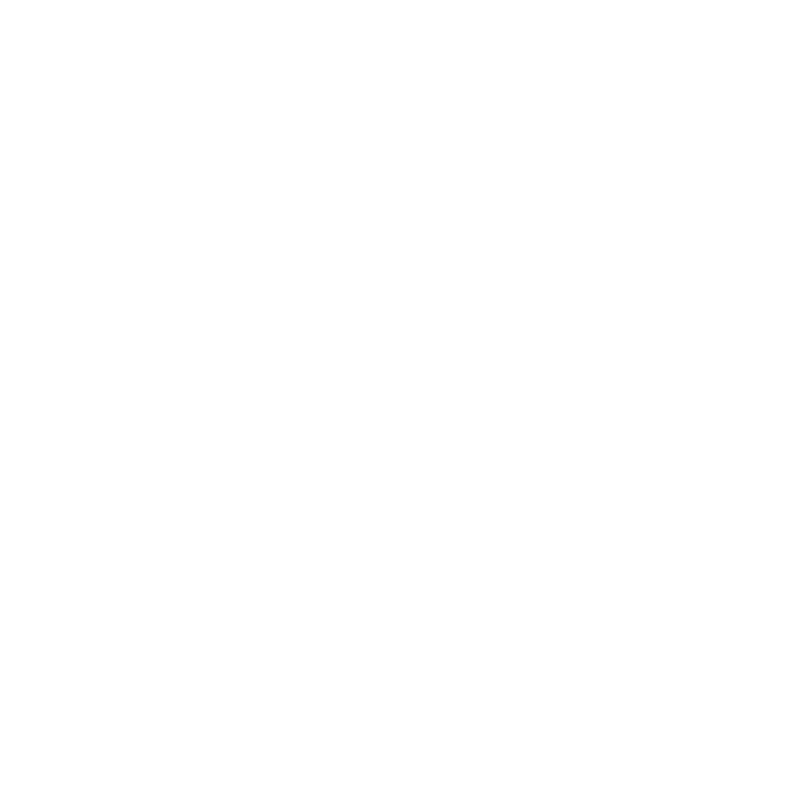

# vladinski.md

[![twitter handle][]][twitter badge]



This repo contains the code behind my personal website and portfolio.
Built using **Next.js** and deployed on **Vercel**.

### Starting The Project

```sh
pnpm i && pnpm start
```

[twitter badge]: https://twitter.com/intent/follow?screen_name=vladinskidev
[twitter handle]: https://img.shields.io/twitter/follow/vladinskidev.svg?style=social&label=Follow
